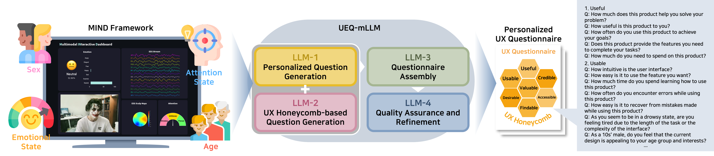
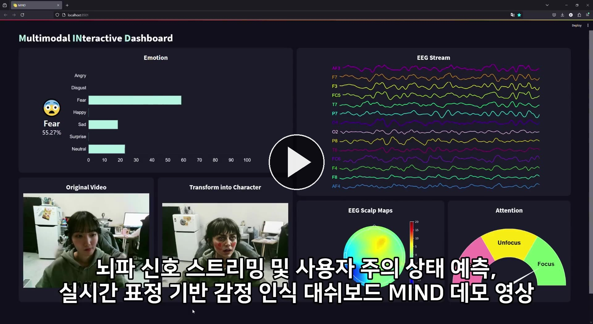

<div align="center">

# UEQ-mLLM

**Agentic LLM Workflows for Personalized User Experience Questionnaire Generation**

[](https://doi.org/10.1109/ICCE-Asia63397.2024.10773955)&nbsp;
[](https://ieeexplore.ieee.org/document/10773955)&nbsp;
[](https://huggingface.co/meta-llama/Meta-Llama-3.1-8B-Instruct)&nbsp;
[](https://www.python.org/)&nbsp;
[](LICENSE)



</div>

---

## Overview

[](https://raw.githubusercontent.com/dusdnKR/UEQ-mLLM/main/assets/mind-demo.mp4)

UX questionnaires are usually static: every participant answers the same items, no matter what they were actually feeling or attending to while using the product. **UEQ-mLLM** replaces that fixed instrument with one generated per user, on the spot, from signals captured live during the session.

Real-time facial-expression and EEG readings from the **MIND** dashboard become a compact description of the user's current state. Four specialized LLM agents then turn that description into a questionnaire: one writes questions targeted at the user's state, one covers the seven facets of the UX honeycomb, one merges them into a single coherent instrument, and one polishes the language.

## Method

All four agents run on one shared **Meta-Llama-3.1-8B-Instruct** pipeline, each prompted into a different role:

| Agent | Role |
|:-----:|------|
| **LLM-1** | Generates questions personalized to the user's current attention and emotional state |
| **LLM-2** | Generates baseline questions covering the seven facets of the UX honeycomb |
| **LLM-3** | Merges the two sets into one questionnaire, filing each personalized question under its best-fitting facet |
| **LLM-4** | Reviews grammar and style on the final questionnaire |

The seven facets — *useful, usable, desirable, findable, accessible, credible, valuable* — come from Morville's UX honeycomb.

A single-LLM baseline (`SingleLLM`) collapses all four roles into one prompt and one call. Each agent can also be individually ablated (`WithoutL1` … `WithoutL4`) to measure its contribution.

## Repository layout

```
UEQ-mLLM/
├── ueq_mllm/                       # Questionnaire generation workflow
│   ├── prompts.py                  # Agent prompts
│   ├── llm.py                      # Shared Llama 3.1 text-generation pipeline
│   ├── workflow.py                 # UEQ-mLLM, the four ablations, and UEQ-sLLM
│   ├── simulate_users.py           # Synthetic user population
│   ├── run_experiment.py           # Batch runner across users and conditions
│   ├── generate_questionnaire.py   # Generate one questionnaire from a single user state
│   └── export_for_geval.py         # Flatten result CSVs into the G-Eval input JSON
├── evaluation/                     # G-Eval scoring pipeline
│   ├── prompts/                    # One judge prompt per criterion
│   ├── gpt4_eval.py                # GPT-4 rates each questionnaire
│   ├── get_score.py                # Ratings -> one score per user and condition
│   ├── get_average.py              # Four criteria -> one 100-point score
│   └── get_t_test.py               # Welch's t-test + FDR correction
├── mind/                           # MIND dashboard — the multimodal data source
│   ├── app.py                      # Flask server, live EEG via Emotiv LSL
│   ├── app_loaded.py               # Flask server, prerecorded EEG + StreamDiffusion
│   ├── dash.py                     # Streamlit front end
│   ├── stream_diffusion_demo.py    # Standalone real-time image generation demo
│   ├── templates/                  # Per-module streaming endpoints
│   └── utils/wrapper.py            # StreamDiffusion wrapper
└── assets/                         # Overview figure and demo video
```

## Getting started

### Generating questionnaires

```bash
pip install torch "transformers>=4.43" accelerate numpy pandas
huggingface-cli login          # Llama 3.1 is a gated model
```

Generate a single questionnaire from a random user state:

```bash
python -m ueq_mllm.generate_questionnaire
```

Or feed in a specific state — for example, a drowsy user in their thirties, as the MIND dashboard would report it:

```bash
python -m ueq_mllm.generate_questionnaire \
    --sex Female --age "30s'" \
    --attention 12.4 24.1 63.5 \
    --emotion 4 3 6 11 22 5 49 \
    --show-stages
```

`--show-stages` prints each agent's raw output.

### Reproducing the experiment

```bash
CUDA_VISIBLE_DEVICES=0,1 python -m ueq_mllm.run_experiment --results results
python -m ueq_mllm.export_for_geval --results results/questionnaires \
                                    --out results/geval_input.json
```

This writes one CSV per user with the final questionnaire from each of the six conditions, plus per-agent intermediate outputs under `results/logs/`. `--start`/`--end` split the run into chunks, and `--seed` makes the sampled user states reproducible.

### Scoring with G-Eval

```bash
pip install openai tqdm scipy statsmodels
export OPENAI_API_KEY=...

for c in con flu ind rel; do python evaluation/gpt4_eval.py --criterion "$c"; done
python evaluation/get_score.py       # ratings -> per-user scores
python evaluation/get_average.py     # -> one 100-point score per system
python evaluation/get_t_test.py      # -> Welch's t-test with FDR correction
```

See [`evaluation/README.md`](evaluation/README.md) for the criteria and the scoring formula.

### Running the MIND dashboard

MIND supplies the emotion and attention percentages that drive LLM-1.

1. Download the `models/` folder from [Google Drive](https://drive.google.com/drive/folders/1djwUiAWDnatcuyIDgYtblJyOTAx_YTBW?usp=sharing) and merge it into `mind/models/`. It holds the KNN attention classifiers and scalers.
2. Install dependencies from `mind/requirements.txt`. Some pins conflict with each other; installing the packages you actually import is more reliable than installing the file wholesale. `mind/requirements-streamdiffusion.txt` covers the separate StreamDiffusion environment.
3. From inside `mind/`, start the Flask backend — `python app.py` for live EEG through the Emotiv Lab Streaming Layer, or `python app_loaded.py` for prerecorded EEG.
4. In a second shell, also from `mind/`, start the front end: `streamlit run dash.py`.

Both processes run at once: Flask serves the streaming endpoints on port 5000 and Streamlit polls them. Run them from `mind/` — the modules resolve `models/`, `datas/`, and `utils/` relative to the working directory. For prerecorded EEG, place your recordings in `mind/datas/`.

## Related work

H. Jo, J. Lee, H. W. Park, M. Kim, **Y. Kim**, and W. H. Lee, "Developing an Integrated Dashboard to Analyze Multimodal Data for User Experience Evaluation," *IEEE ICCE-Asia 2023*, pp. 1–4. — introduces the MIND dashboard in [`mind/`](mind/README.md).

**Y. Kim**, M. J. Lee, and W. H. Lee, "EEG-Informed Adaptive User Experience Questionnaire Generation with Multi-Agent Large Language Models," *IEEE/IEIE ICCE-Asia 2025*, pp. 1–5. — extends this workflow to adapt questionnaires from EEG during the session.

## Acknowledgment

This work was supported by the Convergence and Open Sharing System Program through the National Research Foundation of Korea (NRF) funded by the Ministry of Education (B0080706000707), the Culture, Sports and Tourism R&D Program through the Korea Creative Content Agency grant funded by the Ministry of Culture, Sports and Tourism (RS-2023-00226263), the Institute for Information and Communications Technology Promotion and Evaluation (IITP) grant (2017-0-00655), and the IITP grant funded by the Korea government (MSIT) (RS-2022-00155911, Artificial Intelligence Convergence Innovation Human Resources Development (Kyung Hee University)).

## License

Released under the [MIT License](LICENSE). The MIND dashboard code carries the original copyright from the 2023 dashboard project. `mind/utils/wrapper.py` is adapted from [StreamDiffusion](https://github.com/cumulo-autumn/StreamDiffusion) (Apache-2.0), and `mind/models/haarcascade_frontalface_alt.xml` ships with [OpenCV](https://github.com/opencv/opencv) (BSD).

Use of Meta-Llama-3.1-8B-Instruct is governed by the [Llama 3.1 Community License](https://github.com/meta-llama/llama-models/blob/main/models/llama3_1/LICENSE).

## Citation

```bibtex
@inproceedings{kim2024agentic,
  title     = {Agentic {LLM} Workflows for Personalized User Experience Questionnaire Generation},
  author    = {Kim, Yeonwoo and Lee, Junhyeok and Han, Ju Hyuk and Kim, Minjae and Lee, Howook and Lee, Won Hee},
  booktitle = {2024 IEEE International Conference on Consumer Electronics-Asia (ICCE-Asia)},
  pages     = {1--4},
  year      = {2024},
  address   = {Danang, Vietnam},
  publisher = {IEEE},
  doi       = {10.1109/ICCE-Asia63397.2024.10773955}
}
```
